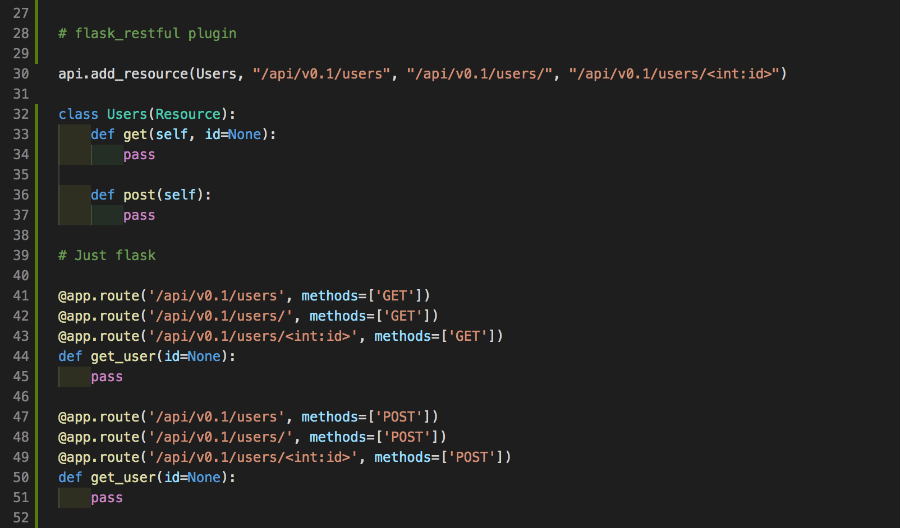

# Переход на новую архитектуру

И так [PHP - зомби](https://vc.ru/dev/90977-zhiv-li-php). После изучения темы пришел к выводу, что хочу сделать полностью кешируемое приложение (статичный сайт - SPA (Single page application), CORF) с удаленным доступом к бекенду. Бек будет обновлять статику через тот же GitHub Pages.

Пример REST API https://www.youtube.com/watch?v=Gu2cWU58FI8

Точкой входа будет `DOMAIN/APP/API/VERSION/RESOURCE`

* /auth – авторизация пользователей
  * Login: GET + Basic Auth => TOKEN (Digest)
    * Max retries
    * Session period
    * Blocked user
  * Logout: DELETE + TOKEN => OK
* /user – работа с пользователями
  * Me: GET + TOKEN => JSON
  * User info: GET + ID + TOKEN => JSON
  * List: GET + TOKEN => List
  * Add user: POST + JSON + TOKEN => OK
  * Delete user: DELETE + ID + TOKEN => OK
  * Modify user: PATCH + ID + JSON + TOKEN => OK
* /group – работа с группами
  * Group info: GET + ID + TOKEN => JSON
  * List: GET + TOKEN => List
  * Add group: POST + ID + TOKEN => OK
  * Delete group: DELETE + ID + TOKEN => OK
  * Modify user: PATCH + ID + JSON + TOKEN => OK
* /post – работа с постами

В качестве базы данных буду использовать https://hub.docker.com/_/postgres

Были еще какие-то специальный токены запросов, чтобы работать асинхронно

## Источники

* Server side
  * REST API — Что такое HATEOAS? https://m.habr.com/en/post/483328/
  * REST API что это https://www.software-testing.ru/library/testing/testing-automation/2958-testing-get-requests
  * REST API https://medium.com/@andr.ivas12/rest-простым-языком-90a0bca0bc78

  * Выбор python фреймворка
    * DJANGO или Flask https://python-scripts.com/flask-or-django#flask-vs-django-differences
    * Nodejs https://nodejs.org/en/about/
  * Flask
    * General
      * https://eax.me/python-flask/
      * https://github.com/afiskon/py-flask-example
    * Flask RESTful
      * https://flask-restful.readthedocs.io/en/latest/
      * https://habr.com/en/company/skillbox/blog/464705
    * Flask Security
      * https://flask-security-too.readthedocs.io/en/stable/
      * https://pythonhosted.org/Flask-Security/
      * https://python-scripts.com/haslib-pbkdf2-check-password
      * https://github.com/hypknowsys/Python-PBKDF2-Flask-Password-Encoder
      * https://www.programcreek.com/python/example/82817/werkzeug.security.generate_password_hash
      * https://habr.com/en/post/346346/
    * Token Authentication
      * https://www.youtube.com/watch?v=WxGBoY5iNXY
    * Flask httpauth
      * https://habr.com/en/post/246699/
      * https://github.com/miguelgrinberg/flask-httpauth
    * Flask + Cookie https://pythonru.com/uroki/12-kuki-vo-flask
    * Flask + SQLAlchemy
      * https://flask-sqlalchemy-russian.readthedocs.io/ru/latest/
      * https://coderlessons.com/tutorials/bazy-dannykh/sqlalchemy/sqlalchemy-kratkoe-rukovodstvo
      * https://pythonru.com/biblioteki/sqlalchemy-v-flask
      * https://github.com/sgangopadhyay/python-rest-api/blob/master/restapi.py
    * Flask Blog
      * https://github.com/olawalejarvis/blog_api_tutorial
      * https://www.codementor.io/@olawalealadeusi896/restful-api-with-python-flask-framework-and-postgres-db-part-1-kbrwbygx5
      * https://www.codementor.io/@olawalealadeusi896/building-a-restful-blog-apis-using-python-and-flask-part-2-l9y8awusp
      * https://www.codementor.io/@olawalealadeusi896/building-a-restful-blog-apis-using-python-and-flask-part-3-lx7rt8pfk
* Client side
  * JS
    * Куки, document.cookie https://learn.javascript.ru/cookie
    * Var or Let https://www.it-rem.ru/javascript-raznitsa-mezhdu-var-i-let.html
    * Babel как использовать с VSCode https://www.youtube.com/watch?v=VrayPysaeGY
    * AJAX Requests
      * есть либа аксиос https://habr.com/en/company/ruvds/blog/477286/
      * Сравниваем различные способы выполнения HTTP-запросов в JavaScript https://yandex.ru/turbo/nuancesprog.ru/s/p/7666/
      * Use basic authentication with jQuery and Ajax https://stackoverflow.com/questions/5507234/use-basic-authentication-with-jquery-and-ajax
      * AJAX and HTTP Basic Auth https://zinoui.com/blog/ajax-basic-authentication
      * Примеры работы с AJAX. Отправка GET, POST, HEAD запросов через AJAX на javascript. https://javascript.ru/blog/gordon-freeman/primery-raboty-s-ajax-otpravka-get-post-head-zaprosov-cherez-ajax-javascript
  * Варианты Python фреймвороков для клиентской части (VueJS vs React (макс советуешь использовать реакт), ангуляр говорит умер). MERN stack.
    * https://rapidapi.com/blog/best-python-api-frameworks/
    * https://habr.com/en/company/piter/blog/458096/
  * SAMPLE client: https://blog.miguelgrinberg.com/post/writing-a-javascript-rest-client
* Database
  * Mongo или Postgres https://www.mongodb.com/compare/mongodb-postgresql
  * Postgres vs Mongo / Олег Бартунов (Postgres Professional) https://www.youtube.com/watch?v=SNzOZKvFZ68

## Вопросы

* Как не дать скрипту гугл аналитики или другим интеграционным вещам доступ к кукам пользователя для авторизации на сайте?
* Etag или Cookie?
* Как ограничить запросы только с домена сайта (можно ли подтвержать это как-то с помощью серта)
* Какой метод для AJAX? Fetch?
* Какой REST API на Python выбрать? Flask, Django или вообще не python, а nodejs?

## Отказался от Flask RESTful

Flask-RESTful is an extension for Flask that adds support for quickly building REST APIs. It is a lightweight abstraction that works with your existing ORM/libraries. Flask-RESTful encourages best practices with minimal setup. If you are familiar with Flask, Flask-RESTful should be easy to pick up. https://flask-restful.readthedocs.io/en/latest/

Имеет не очевидные преобразовани в тч вывод сразу в application/json и jsonify не работает как положено.

Преобразования сокращают код не существенно, при этом не понятно как будут вести себя декораторы для аутентификации и куда их навешивать.



## Тестирование

Для тестирования можно использовать Heroku или PwD
https://labs.play-with-docker.com/?stack=https://raw.githubusercontent.com/docker-library/docs/9efeec18b6b2ed232cf0fbd3914b6211e16e242c/postgres/stack.yml

## Запуск

https://flask.palletsprojects.com/en/1.1.x/installation/

```bash
cd myproject
python3 -m venv venv
. venv/bin/activate
```
